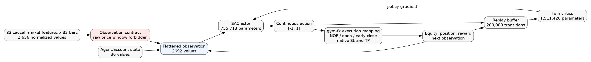

# ETH SAC easy-to-normal experiment

This document describes the paired experiment that tests whether easy-mode
pretraining improves subsequent normal-mode SAC training. It is a prospective
contract: the materialized configs and manifests must match it before fleet
dispatch.

## Question and arms

The independent variable is the presence of easy pretraining. For every seed:

| Arm | Phase 1 | Phase 2 | Starting state of normal phase |
|---|---|---|---|
| N (control) | none | normal | declared cold-start initialization |
| EN (treatment) | easy | normal | same trained network from easy; no weight reinitialization |

The normal phase is identical between arms: data, LR, epochs, patience,
activity contract, checkpoint ranking and evaluation surfaces. EN receives
additional easy compute, which is reported rather than hidden by truncating its
normal phase.

At least four paired seeds (`101`, `202`, `303`, `404`) run counterbalanced
across the four GPUs. The primary endpoint is paired best eligible normal-phase
monitor score, `EN - N`. Return, drawdown, Sharpe, trades, exposure, action
diversity, selected epoch, stopping epoch and compute are secondary endpoints.
The directional aggregation rule must be committed before a terminal arm
exists.

## Epoch and stopping contract

| Setting | Easy phase | Normal phase |
|---|---:|---:|
| Maximum epochs | 2,000 | 2,000 |
| Timesteps per epoch | 20,000 | 20,000 |
| Early-stopping patience | 60 | 60 |
| Patience active from | epoch 40 | epoch 40 |
| Learning rate | fixed `3e-4` | fixed `3e-4` |
| LR scheduler | none | none |
| Checkpoint source | eligible monitor | eligible monitor |
| Terminal zero-trade penalty | yes | yes |
| Negative return alone causes rejection | no | no |

NOP is a valid action inside an episode. The zero-trade penalty applies only
if the entire scored episode finishes without a trade. Easy may remain
unprofitable while acquiring activity; it is not stopped solely because profit
is negative.

The EN handoff preserves actor and critic tensors byte-for-byte. Optimizer,
entropy coefficient, replay buffer and normalization-state continuity must each
be declared and tested; no component may reset silently. At least two mapped
normal decision crossings are required before the handoff is accepted.

## Data roles

| Role | Period | Rows | Used for selection? |
|---|---|---:|---|
| Fit/train | 2017-09-28 to 2022-12-31 | 11,509 | model updates |
| Monitor | 2022 | 2,190 | early stopping/checkpoint monitor |
| Inner validation | 2023 | 2,190 | configuration comparison |
| Outer validation | 2024 | 2,196 | decision confirmation only |
| Sealed test | 2025 | 2,190 | no, opened only after design freeze |

The monitor overlaps the tail of fit by design and must be treated as a
monitor, not independent validation. Causal context rows initialize features
without contributing actions, rewards, replay, trades or score.

## Current model

The accepted checkpoint uses Stable-Baselines3 SAC `MlpPolicy`, not a
multi-input Keras architecture. The corrected observation contains 2,692
values: 83 normalized causal features over 32 bars (2,656) plus 36 agent/state
values. The retired 2,724-value contract additionally included 32 raw prices
and is forbidden because it caused policy collapse.

### Component diagrams

[](eth_sac_assembly.png)

[Actor detail](eth_sac_actor.png) · [Twin-critic detail](eth_sac_critics.png) ·
[machine-readable summary](eth_sac_model_summary.json)

Parameter counts from the loaded accepted checkpoint:

| Component | Parameters |
|---|---:|
| Actor | 755,713 |
| Twin online critics | 1,511,426 |
| Twin target critics | 1,511,426 |
| Optimized online total | 2,267,139 |

The actor maps `2692 -> 256 -> 256 -> 1` with ReLU hidden layers, a bounded
mean head and generalized state-dependent exploration (gSDE). Each critic maps
the concatenated observation/action vector `2693 -> 256 -> 256 -> 1`; SAC uses
two critics and their Polyak-updated targets.

## Execution semantics

The scalar action is evaluated on every bar, including while a position is
open. It controls NOP, direction/entry and model-driven early closing. Entry
orders carry native ATR-derived SL and TP. The environment then records equity,
position state and reward into the replay buffer. Order-type optimization is a
later execution-risk stage and is not a factor in this causal experiment.

## Reproduction

```bash
python tools/export_sac_architecture.py \
  /path/to/accepted/best_model.zip docs/architecture
dot -Tpng docs/architecture/eth_sac_actor.dot \
  -o docs/architecture/eth_sac_actor.png
dot -Tpng docs/architecture/eth_sac_critics.dot \
  -o docs/architecture/eth_sac_critics.png
dot -Tpng docs/architecture/eth_sac_assembly.dot \
  -o docs/architecture/eth_sac_assembly.png
```

See [hyperparameters and DOIN ranges](ETH_SAC_HYPERPARAMETERS.md) for the
fixed starting point and the later staged search space.
